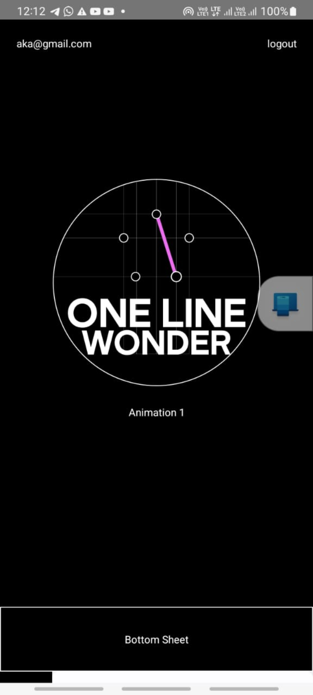
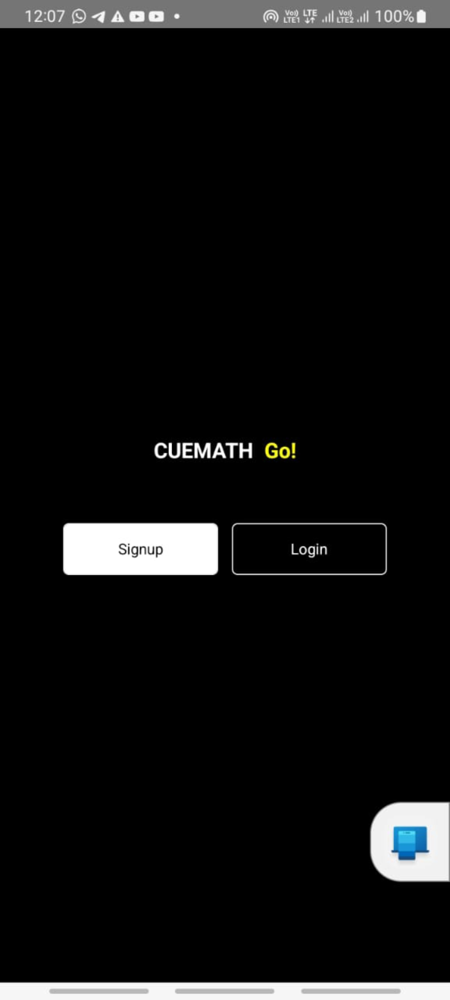

# Lottie Project

## Introduction
The Lottie Project integrates captivating Lottie animations seamlessly into various components and screens, enriching the user experience with creative and versatile animations. The app includes features such as login, logout, signup, and interactive Lottie animations.

## Project Type
Frontend | Backend | Fullstack

## Directory Structure
src/
├─ components/
├─ screens/


## Video Walkthrough of the project
[https://drive.google.com/file/d/1FauNNIuJxZCwLdSfeR8QzZJ6s_5Y-i6j/view] [ 1 - 3 minutes ]


## Images




## Features
Authentication: Users can log in, log out, and sign up using Async Storage.
Interactive Lottie Animations:
Clicking on the first Lottie opens a WebView.
Clicking on the second Lottie plays the Lottie animation with a progress bar.
Clicking on the third Lottie opens a bottom sheet that can be scrolled down.

## Installation & Getting started
Detailed instructions on how to install, configure, and get the project running. For BE/FS projects, guide the reviewer how to check mongodb schema etc.

```bash
npm start ----reset-cache
npm run android
```


Include screenshots as necessary.

## Technology Stack
List and provide a brief overview of the technologies used in the project.

- React Native